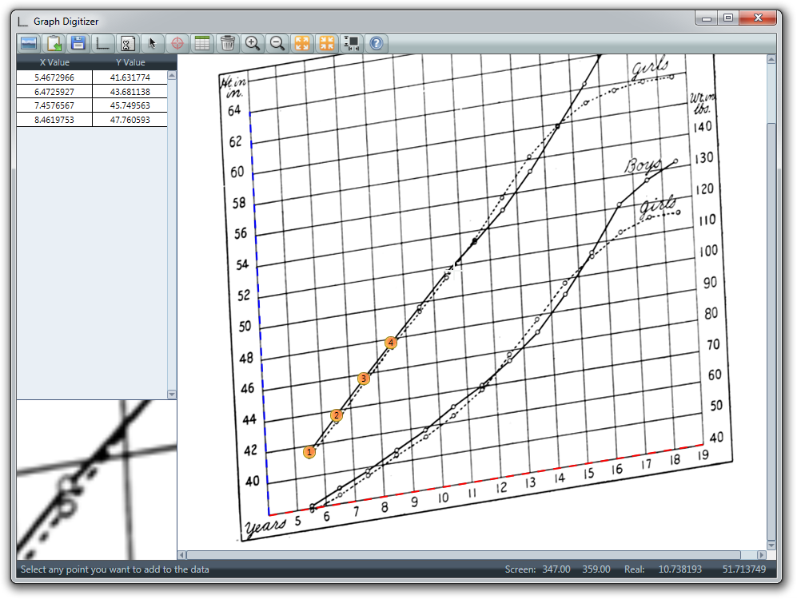

# Graph Digitizer

A standalone Winodws desktop tool to extract the numeric coordinates of a 2D graph in image format.

### Details

Once the axes of the graph are defined, the program will translate screen coordinates into graph coordinates. The axes can also
be be logarithmic.

The points can be easily copied into the clipboard and pasted in other programs, such as text files or spreadsheets. The program
also supports graphs that are not perfectly square (e.g. from an angled photograph).

**Note: Although the latest release is fully functional, the project is quite old and undergoing several changes that will allow
further growth. The most important of these is the migration from a pure view approach to the MVVM pattern. After this, testing and
an a CI/CD pipeline will also be implemented.**

### Download

The latest version of the tool can be downloaded from the [Releases](https://github.com/fernandreu/graph-digitizer/releases) section
of this GitHub repository.

### Screenshots

